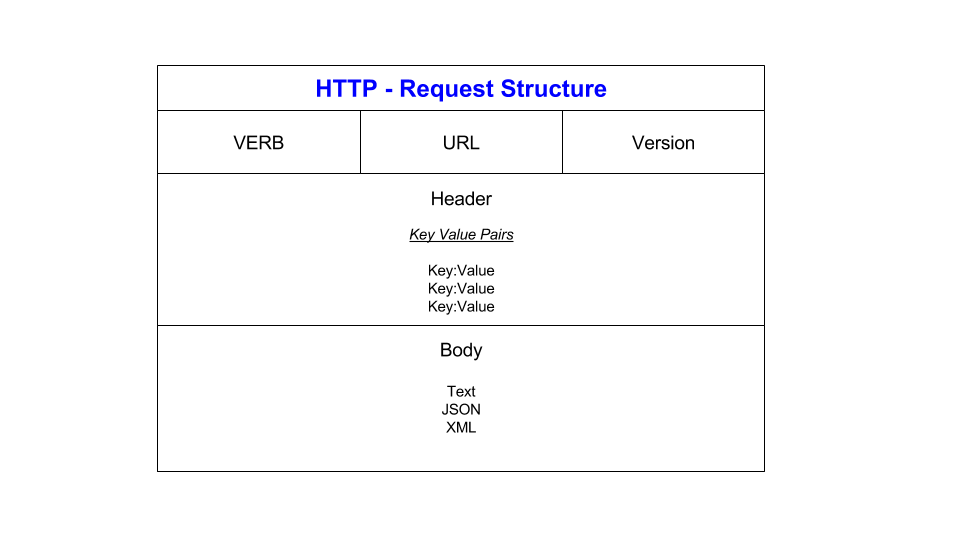
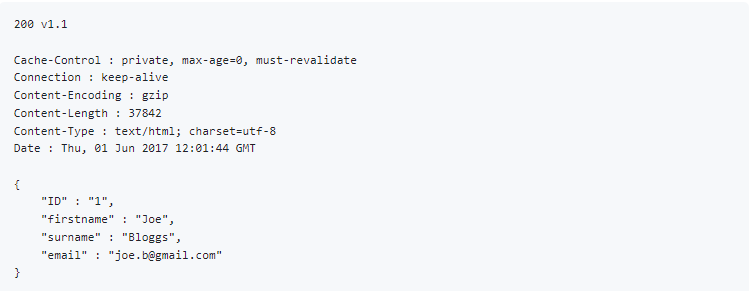

# APIs

### What is an API?

An API is a way to transfer data from a separate server or service, regardless of the languages used.

The letters stand for:

A = Application
P = Program
I = Interface

### Here is a diagram which shows how they work:

- Information from the Client is passed to the API using HTTP Methods.
- This is then transferred to the Server using HTTP Requests.
- Data travels from the Server to the API.
- Then from the API to the Client (usually using JSON).

### Why are they so popular?

Because APIs come with a set of instructions, they are easy to use and developers can instantly access the service by following the instructions.  This is the reason why they are so popular.

### What is a REST API?

The letters stand for:

RE = Representational
S = State
T = Transfer

REST APIs are lightweight, maintainable, scalable.  They can be developed using most programming languages and support a variety of data formats.

### What makes an API RESTful?

The following makes an API RESTful:

- Representation and data flow
  - This means that it makes data flow between client, API and server, faster.
  - This should be considered before other factors.
- Messages
  - How data is exchanged between server and client.
- Unique URIs/ naming
  - The same piece of data, such as the name or email address of a user, should only belong to one URI (Uniform Resource Identifier). (ibm.com)
- Statelessness
  - The state of a request.
    - Each request needs to include all information.
    - Information is not stored.
- Caching
  - Storing data in temporary locations so that it can be accessed faster.
- Client-Server decoupling
  - Client and server applications must be completely independent of each other.
- Layered system architecture
  - The calls and responses go through different layers.
  - There may be different intermediaries in the communication loop.
  - REST APIs need to be designed so that neither the client nor the server can tell whether it communicates with the end application or the intermediary.
- Code on demand (optional)
  - REST APIs usually send static resources, but in certain cases, responses can also contain executable code (such as Java applets). In these cases, the code should only run on-demand.

### What is HTTP(S)?

The letters stand for:

H = Hyper
T = Text
T = Transfer
P = Protocol
S = Secure

It is a protocol (set of rules) used for exchanging information over the internet. If it has an 'S' at the end, it is a secure because the data that is being passed through has been encrypted.

HTTP is used to pass information from Server to Client and back. It works with a request/ response system.

### HTTP Messages

There are two types of HTTP messages.  The request and the response.

### HTTP request structure

Below is an image of a HTTP request:

- VERB: more info further down...
- URL: This is the destination of the request.  It would have key: value pairs in the Header and some information as the body.
- Version: This is the version of HTTP.

### HTTP response structure

Below is an image of a HTTP response:

- The first line is a status line.
- 200 is a status code (in this case, successful). 
- v1.1 is the protocol version.
- The next section includes the headers.
- Theses are formatted in key: value pairs.
- The last part is the body.
- Not all responses have one.

### HTTP Methods/ Verbs

Below are the five HTTP methods:

- GET
  - 'Gets' a message (or information).
  - Considered a safe method.
- POST
    - Used to create a new resource into the collection of resources (restfulapi.net).
    - Is not considered a safe method nor idempotent (can be applied several times without changing result).
- PUT
  - Used to update.
  - These are not cacheable.
- DELETE
  - Deletes the resources.
  - These are idempotent.
  - These are not cacheable.
- PATCH
  - Makes a partial update.

### What is statelessness?

Statelessness in relation to HTTP means that no information is stored by either party (sender or receiver).

### What is caching?

Caching is when data is stored in a temporary location for faster access.